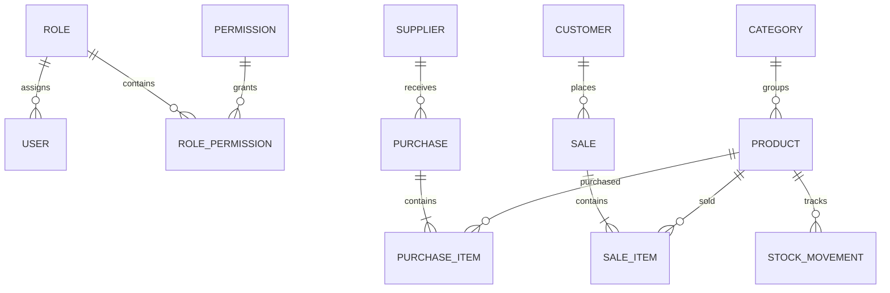

# SmartBiz ERP — Entity Relationship Overview

## Inventory rule

`Product.CurrentStock` is updated only by business transactions. Purchases create positive stock movements; sales create negative stock movements after validating availability.
